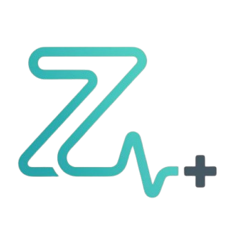

# Zentis AI: The Future of Health is Conversational

<div align="center">
  
  <br />
  <h1>Zentis AI</h1>
  <p><strong>Next-Gen Healthcare Intelligence & Clinical Co-Pilot</strong></p>
  <p>
    <a href="#features">Features</a> •
    <a href="#agents">AI Agents</a> •
    <a href="#tech-stack">Tech Stack</a> •
    <a href="#getting-started">Getting Started</a>
  </p>
</div>

---

## 🚀 Revolutionizing Clinical Workflows

**Zentis AI** is not just another healthcare app; it's a **comprehensive clinical intelligence ecosystem**. It instantly transforms complex patient data into actionable insights, enabling clinicians to make faster, more accurate decisions at the point of care.

Imagine a world where:
*   **Patient data is summarized instantly.** No more digging through endless charts.
*   **Specialized AI agents collaborate** to provide multidisciplinary insights (Cardiology, Oncology, Neurology, and more).
*   **Real-time biomarkers** are detected from audio and video during patient interactions.
*   **Documentation is automated**, freeing you to focus on the patient, not the screen.

**Zentis is that world.**

---

## ✨ Key Features

### 🧠 Comprehensive Medical Intelligence
Go beyond general knowledge. Zentis employs a **Multi-Agent System (MAS)** where each agent is an expert in its field, trained on the latest guidelines.

### 🤝 Multi-Agent Collaboration
*   **Bio-AI Board:** Simulates a multidisciplinary tumor board. Got a complex Cardiorenal case? The Nephrology and Cardiology agents will debate and synthesize a consensus report.
*   **Clinical Critics:** An adversarial "Grand Rounds" mode where AI agents challenge treatment plans to uncover blind spots and ensure safety.

### 👁️ Live Bio-Signal Assistant
A multimodal, real-time monitor acting as your ambient scribe and diagnostic aid:
*   **Audio Biomarkers:** Detects subtle cues like Dyspnea, Dysarthria, Anxiety, and Cough.
*   **Visual Biomarkers:** Identifies physical signs such as Cyanosis, Pallor, JVD, Tremors, and Facial Asymmetry.
*   **Smart HUD:** Correlates real-time detections with patient history (e.g., *"Tremor detected -> Possible side effect of Albuterol"*).

### 📊 Advanced Diagnostics & Data Visualization
*   **Trend Analysis:** Interactive charts for Labs (BNP, Cr, K+), Vitals, and LVEF with predictive outlooks.
*   **Image Analysis:** Multimodal interpretation of X-rays, ECGs, and CT slices.
*   **Report Comparison:** Side-by-side analysis of sequential reports to highlight interval changes.
*   **Risk Stratification:** Automated calculation of critical scores (CHA₂DS₂-VASc, HAS-BLED, ASCVD).

### 🛡️ Treatment & Safety Protocols
*   **GDMT Compliance:** realtime audits of heart failure medications against current guidelines.
*   **Contraindication Checker:** Cross-references prescriptions with allergies, conditions, and live lab values.
*   **Dosage Optimization:** Intelligent titration suggestions based on renal function and vitals.

### ⚡ Workflow Automation
*   **Smart Ingestion:** Upload PDF, DICOM, or Images. Zentis extracts metadata, generates summaries, and files them automatically.
*   **Daily Huddle:** Generates a "morning report" of high-risk patients and care gaps.
*   **Automated Notes:** Drafts structured SOAP notes from chat history and live transcripts.

---

## 🤖 Specialized AI Agents

Zentis is powered by a diverse squad of specialized agents:

| Specialty | Capabilities |
| :--- | :--- |
| **Cardiology** | Interventional (SYNTAX), EP (Device Interrogation), Advanced HF (LVAD), CTA (CAD-RADS) |
| **Neurology** | Stroke protocols, MRI brain analysis, seizure management |
| **Oncology** | TNM staging, biomarker analysis, treatment protocols |
| **Internal Med** | Nephrology, GI, Pulmonology, Endocrinology, Infectious Disease, Rheumatology |
| **Pharmacist** | Drug interaction checks, dosage adjustments, side effect monitoring |
| **Psychiatrist** | Mental health assessment, medication management, therapy recommendations |
| **Nutritionist** | Dietary planning, nutritional analysis, lifestyle recommendations |

---

## 🛠️ Tech Stack

Built with cutting-edge technology for performance, scalability, and security:

*   **Frontend:** React 19, TypeScript, Vite, Tailwind CSS
*   **AI/LLM:** Google Gemini 1.5 Pro/Flash, Vertex AI
*   **Backend:** Firebase (Functions, Firestore, Storage, Auth)
*   **State Management:** React Context API
*   **Styling:** Tailwind CSS with custom animations and glassmorphism
*   **Security:** HIPAA-compliant architecture, Role-Based Access Control (RBAC)

---

## 🚀 Getting Started

### Prerequisites

*   Node.js (v18+) and npm
*   Firebase CLI (`npm install -g firebase-tools`)
*   A valid Google Gemini API key

### Installation

1.  **Clone the repository:**
    ```bash
    git clone https://github.com/veerababumanyam/zentis.git
    cd zentis
    ```

2.  **Install dependencies:**
    ```bash
    npm install
    ```

3.  **Configure Environment:**
    Create a `.env.local` file with your Firebase and Gemini credentials.

4.  **Run Locally:**
    ```bash
    npm run dev
    ```

5.  **Build for Production:**
    ```bash
    npm run build
    ```

---

<div align="center">
  <p>Designed & Architected by <strong>Veera Babu Manyam</strong></p>
  <p><em>Empowering Clinicians. Saving Lives.</em></p>
</div>
